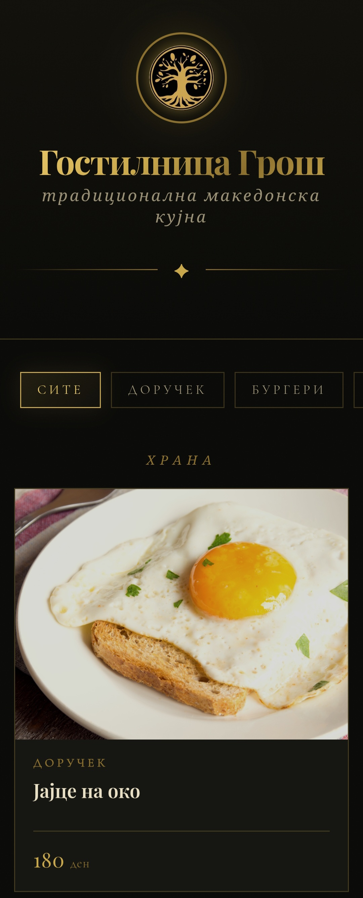
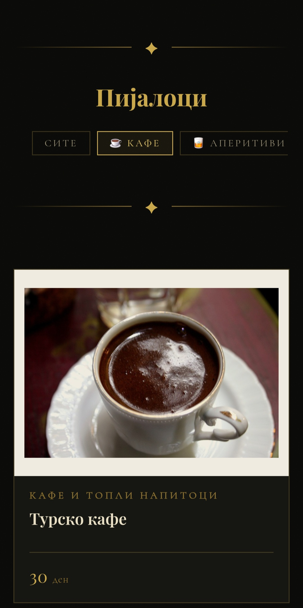

# Gostilnica Gros: Digital Menu

A responsive digital menu website for **Gostilnica Gros**, a traditional Macedonian restaurant. Guests can browse the full food and drinks menu by category, with photos, descriptions and prices.

🔗 **Live demo:** (https://lazevaa.github.io/gros_menu/menu.html)

## Screenshots

  
  

## Features
- Food menu split into 10 categories (breakfast, burgers, cold and hot starters, salads, grill, oven specialties, fish, sides, desserts)
- Separate drinks section with sub-filters (coffee, aperitifs, vodka, gin, cognac, whisky, liqueurs, wine, beer, water, juices)
- Instant category filtering with no page reload, using vanilla JavaScript
- Card layout with image, name, description and price
- Custom visual design with a gold-accent, traditional restaurant look
- 150+ menu items, all content in Macedonian

## Tech stack
- HTML5
- CSS3 (custom styling, Google Fonts: Playfair Display, Cormorant Garamond)
- Vanilla JavaScript (DOM manipulation, event handling)
- Hosted on GitHub Pages

## Project structure

## Run locally
1. Clone the repository: `git clone https://github.com/lazevaa/gros_menu`
2. Open `menu.html` in your browser. No build step or dependencies needed.

## Author
Lazeva, Computer Science student at FERI, University of Maribor
